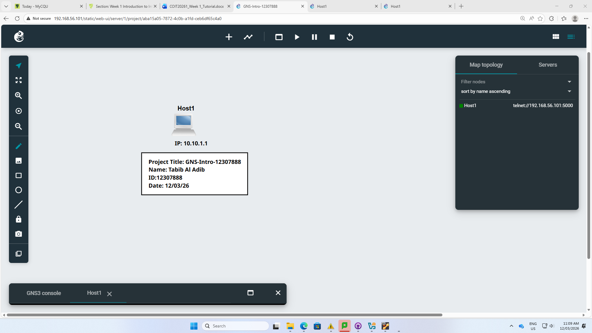
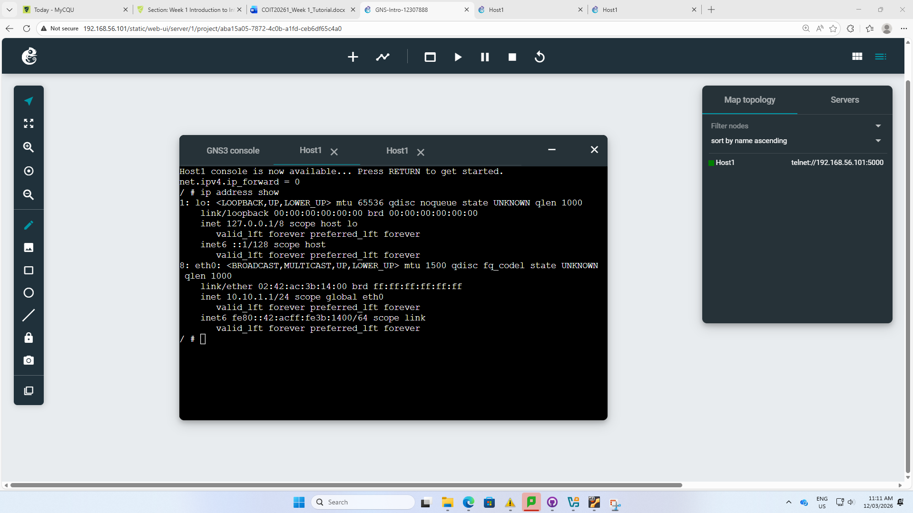

# Week 01 – GNS3 Basics & Environment Setup

## Student Details
- **Name:** Tabib Al Adib  
- **Student ID:** 12307888  
- **Unit:** COIT20261 – Network Services and Automation  
- **Week:** 01  
- **Date:** 12/03/2026  

---

## Objective
The aim of this week was to gain hands-on experience with:
- Setting up GNS3 environment  
- Creating a basic network topology  
- Configuring a static IP address on a Linux host  
- Verifying network configuration using Linux commands  

---

## Key Concepts Learned
- **Network Simulation:** Using GNS3 to create virtual network environments  
- **Static IP Configuration:** Assigning IP manually via `/etc/network/interfaces`  
- **Linux Networking Commands:** Using `ip address show`  
- **IP Forwarding:** Understanding host vs router behavior  
- **Virtualisation:** Role of VirtualBox in hosting GNS3 VM  

---

## Technical Activities

### Task 1: GNS3 Project Creation
- Created a project: **GNS-Intro-12307888**
- Added a **Linux Host (Host1)**
- Inserted annotations:
  - Project Title
  - Name
  - Student ID
  - Date
- Assigned IP label: **10.10.1.1**

---

### Task 2: Static IP Configuration

The IP address was configured by editing:
/etc/network/interfaces

Configuration Used:
auto eth0
iface eth0 inet static
   address 10.10.1.1
   netmask 255.255.255.0
   up sysctl net.ipv4.ip_forward=0

---   
### Explanation:
auto eth0 → Enables interface on startup

iface eth0 inet static → Sets static IP mode

address → Assigned IP address

netmask → Defines subnet (/24)

ip_forward=0 → Disables routing (host behavior)

---

### Task 3: Running & Testing
Started the node
Opened console in browser

## Ran command:
ip address show

## Testing Results
IP Address Verification

# The output confirmed:

Interface: eth0
IP Address: 10.10.1.1/24
Status: UP and active

### Reflection

This week provided a strong foundation in network simulation and Linux networking. I learned how to manually configure a static IP address, which is essential for controlling network behavior in real-world scenarios.

One key insight was understanding the importance of IP forwarding. Even though the Linux host can act as a router, disabling forwarding ensures it behaves correctly as an end device.

# IP Forwarding Check
net.ipv4.ip_forward = 0

Confirms device is acting as a host (not router)
