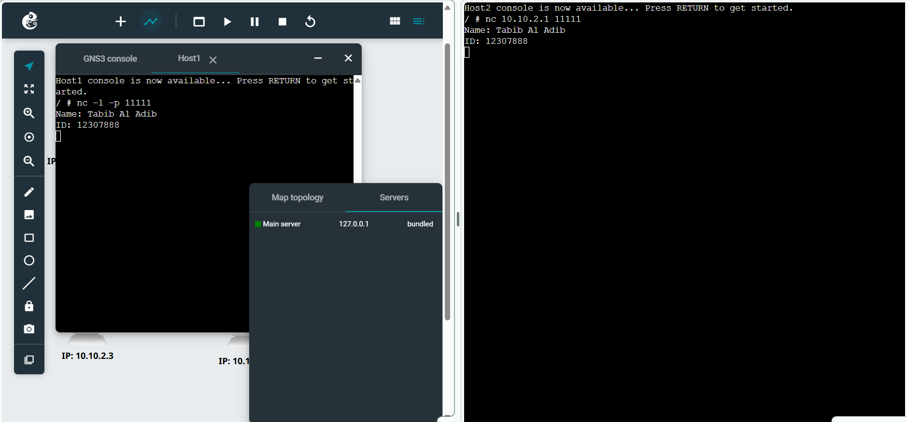

#  Week 03 – Netcat Communication & Packet Capture

##   Student Details
- **Name:** Tabib Al Adib  
- **Student ID:** 12307888  
- **Unit:** COIT20261 – Network Services and Automation  
- **Week:** 03  

---

##  Objective
The aim of this week was to:
- Understand client-server communication using Netcat  
- Send messages between hosts over a network  
- Capture network packets using GNS3  
- Transfer and store packet capture files  

---

##  Key Concepts Learned
- **Netcat (nc):** A tool for testing network communication  
- **Client-Server Model:** One host listens (server), another connects (client)  
- **TCP Communication:** Sending messages over a specified port  
- **Packet Capture:** Recording network traffic in `.pcap` format  
- **Ping vs Netcat:**  
  - Ping → Network layer (ICMP)  
  - Netcat → Application layer (TCP/UDP)  

---

## Technical Activities

### Task 1: Netcat Communication

Two hosts were used:
- **Host1 → Server**
- **Host2 → Client**

### Server Command:
nc -l -p 11111

## Testing Results

### Message Exchange
#### From Client → Server:
Name: Tabib Al Adib
ID: 12307888
Communication was successful:
- Client sent message ✔
- Server received message ✔

### This confirms:

TCP connection established
Application-level communication working

---
## Reflection

This task helped me understand how communication works between two devices using a simple client-server model. Unlike ping, which only checks connectivity, Netcat allows actual data transmission between hosts.

I learned how:

- A server listens on a port

- A client connects using IP and port

- Messages are exchanged in real time

---

## Task 2: Packet Capture

### Aim
To capture network traffic between hosts and analyse communication using packet capture.

---

### Steps Performed

1. Selected the link between **Host A and the switch**
2. Started packet capture in GNS3  
3. Performed the following actions:
   - Sent **3 ping requests** from Host A to Host B  
   - Used Netcat to send message from Host A to Host C  
4. Stopped the packet capture  
5. Transferred the `.pcap` file from GNS3 server to local machine  

---

### Testing Results

The packet capture file contains:

- **ICMP packets (Ping)**
  - Echo request and reply between Host A and Host B  
- **TCP packets (Netcat)**
  - Connection establishment (TCP handshake)  
  - Data transfer (Name and ID message)  

This confirms:
- Network connectivity is working ✔  
- Application-level communication is successful ✔  

---

### Capture File

[Capture-Basics-12307888-ping-netcat.pcap](Capture-Basics-12307888-ping-netcat.pcap)

---

### Observations
#### Verified the packet (.pcap file) using Wireshark
- Ping uses **ICMP protocol**, which operates at the network layer  
- Netcat uses **TCP protocol**, which operates at the transport/application layer  
- TCP communication includes:
  - SYN  
  - SYN-ACK  
  - ACK  

This shows how reliable communication is established before data transfer.

---

### 💡 Reflection (Packet Capture)

Capturing packets helped me understand how data actually flows through the network. It provided deeper insight into how different protocols behave.

I observed that:
- Ping is simpler and only checks connectivity  
- Netcat involves multiple steps (handshake + data transfer)  

Using packet capture tools like this is very useful for:
- Troubleshooting network issues  
- Analysing traffic behaviour  
- Understanding real-world networking  

---
