# 📄 Week 04 – Routing Tables & OSPF Dynamic Routing

## 👤 Student Details
- **Name:** Tabib Al Adib  
- **Student ID:** 12307888  
- **Unit:** COIT20261 – Network Services and Automation  
- **Week:** 04  

---

# Task 1: Routing Tables & Network Testing

## Objective
- Configure a multi-subnet network  
- View routing tables  
- Enable/disable IP forwarding  
- Test communication across subnets  

---

## Network Topology
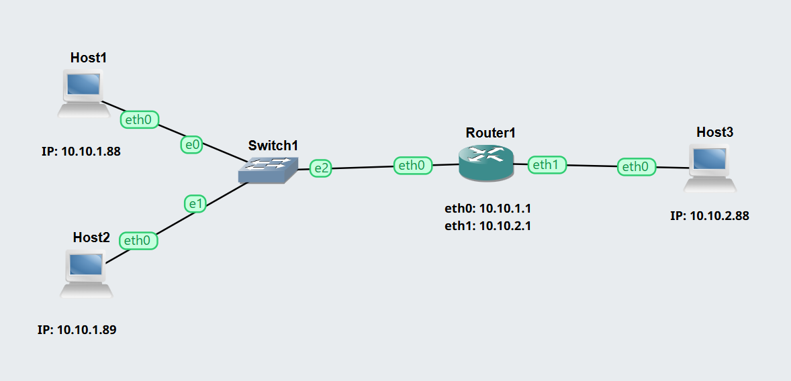

---

##  IP Addressing Scheme

### Subnet 1: 10.10.1.0/24
| Device | IP Address |
|--------|-----------|
| Host1 | 10.10.1.88 |
| Host2 | 10.10.1.89 |
| Router (eth0) | 10.10.1.1 |

### Subnet 2: 10.10.2.0/24
| Device | IP Address |
|--------|-----------|
| Host3 | 10.10.2.88 |
| Router (eth1) | 10.10.2.1 |

---

## Routing Tables

### Host1

- default via 10.10.1.1 dev eth0
- 10.10.1.0/24 dev eth0 scope link src 10.10.1.88
  
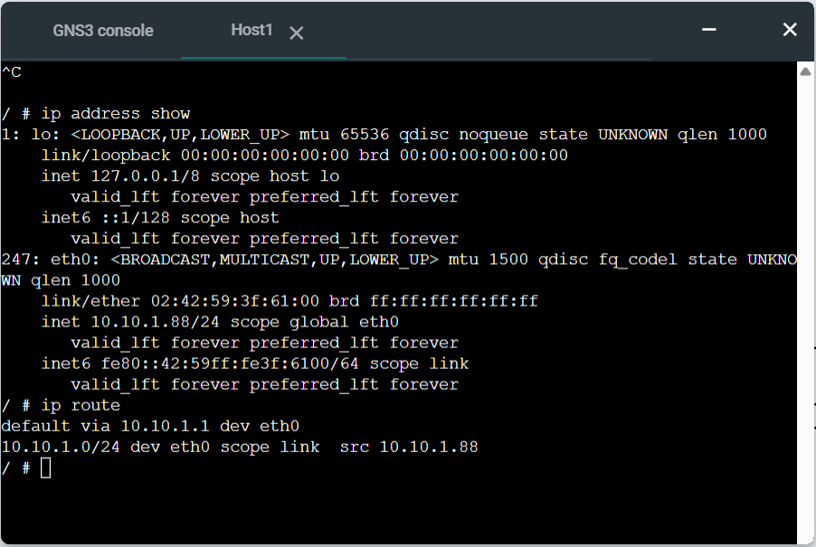

### Host2
- default via 10.10.1.1 dev eth0
- 10.10.1.0/24 dev eth0 scope link src 10.10.1.89
  
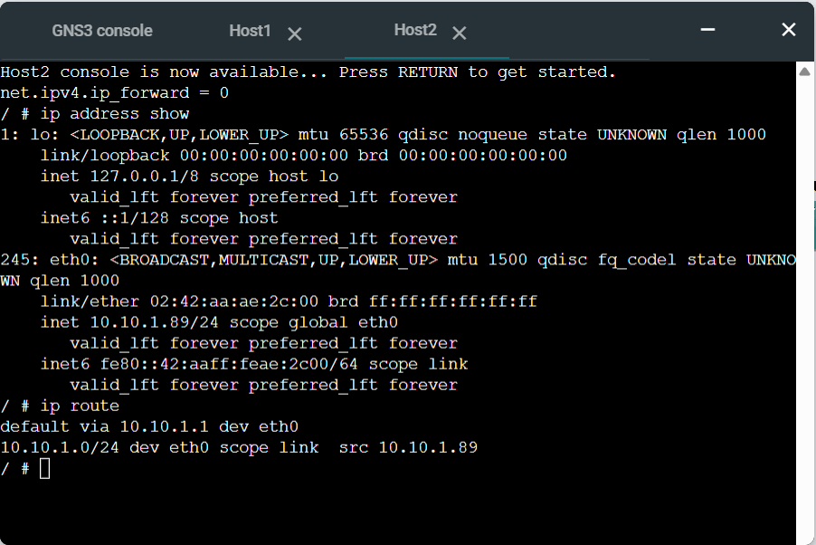

### Host3
- default via 10.10.2.1 dev eth0
- 10.10.2.0/24 dev eth0 scope link src 10.10.2.88

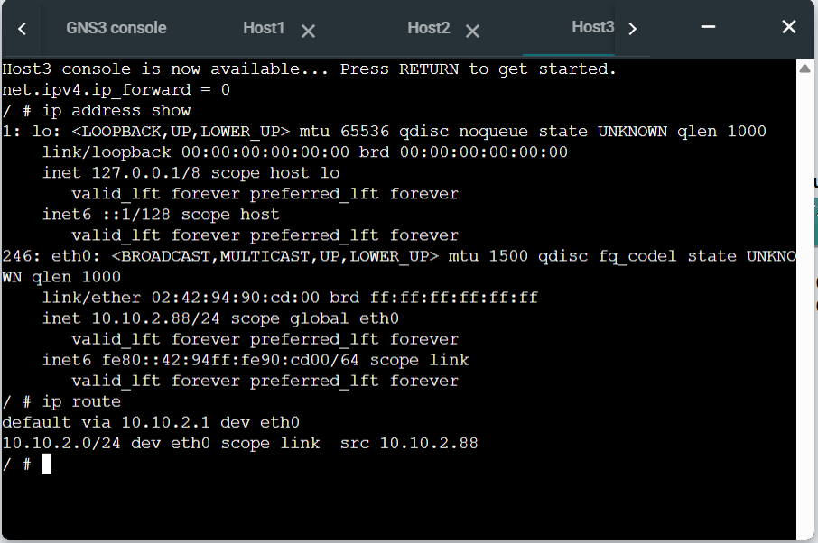

### Router
- 10.10.1.0/24 dev eth0 scope link src 10.10.1.1
- 10.10.2.0/24 dev eth1 scope link src 10.10.2.1
  
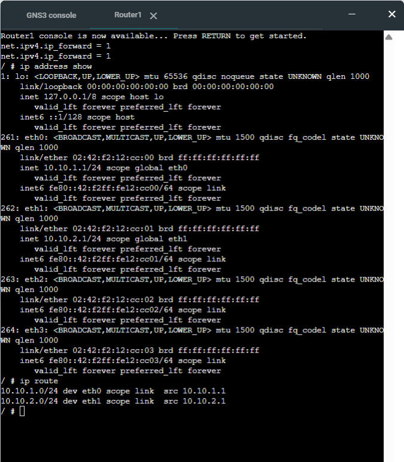

### Forwarding Status

| Device | IP Forwarding |
|--------|--------------|
| Hosts  | Disabled (0) |
| Router | Enabled (1)  |

### Ping Test
ping 10.10.1.88

#### Result:
- 0% packet loss
- TTL = 63 → Passed through 1 router
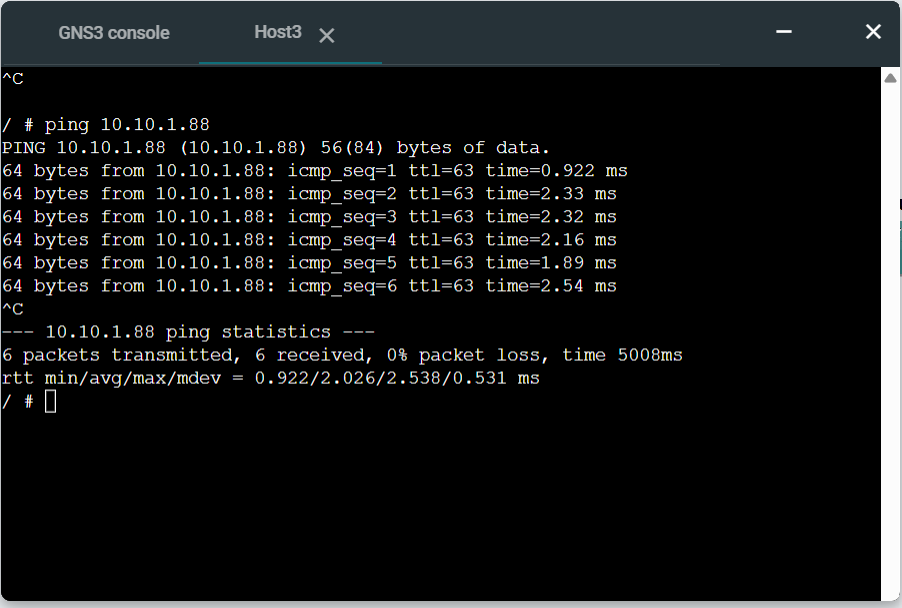

## Reflection (Task 1)

This task demonstrated how routing works between subnets. I learned that hosts require a default gateway to communicate outside their network, and routers must have IP forwarding enabled to route packets.

---

# Task 2: Dynamic Routing with OSPF
## Objective
- Observe OSPF dynamic routing
- Analyse routing tables
- Identify neighbour routers
- Observe path changes using traceroute

## OSPF Network Topology

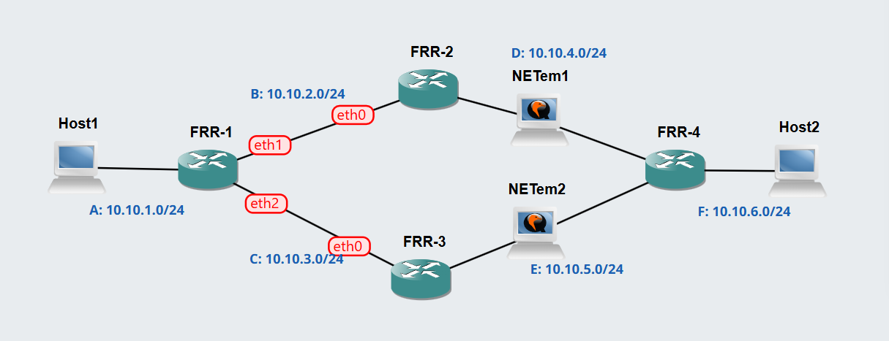

## OSPF Neighbour Routers (FRR1)

| Neighbour Router | IP Address | Interface |
|------------------|-----------|-----------|
| FRR2             | 10.10.2.2 | eth1      |
| FRR3             | 10.10.3.3 | eth2      |

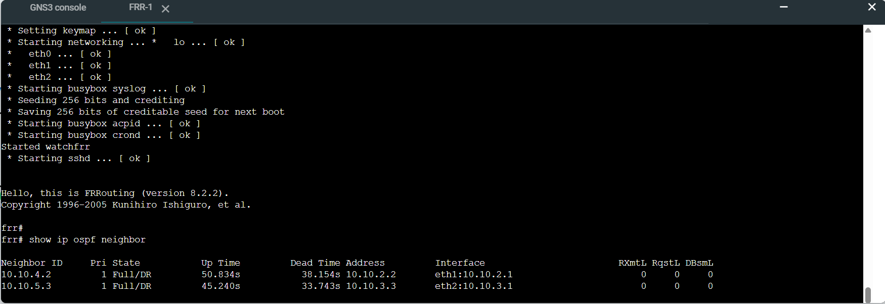

## Routing Tables (OSPF)
FRR1 – OSPF Routes
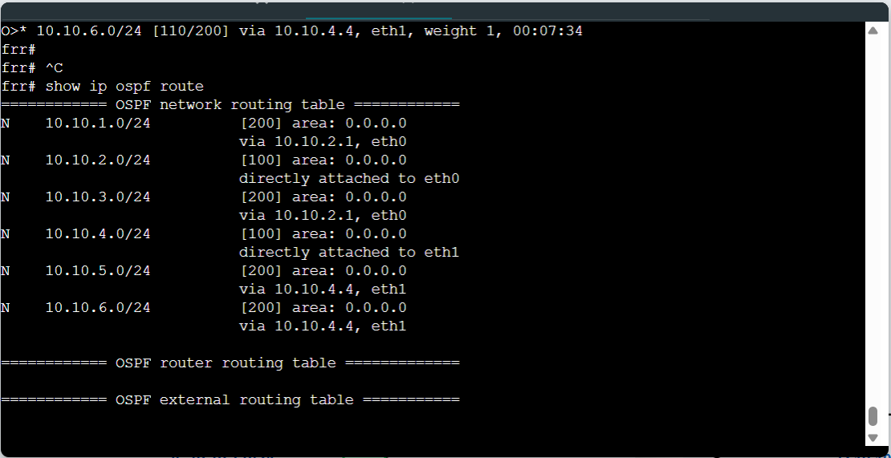

FRR1 – Full Routing Table

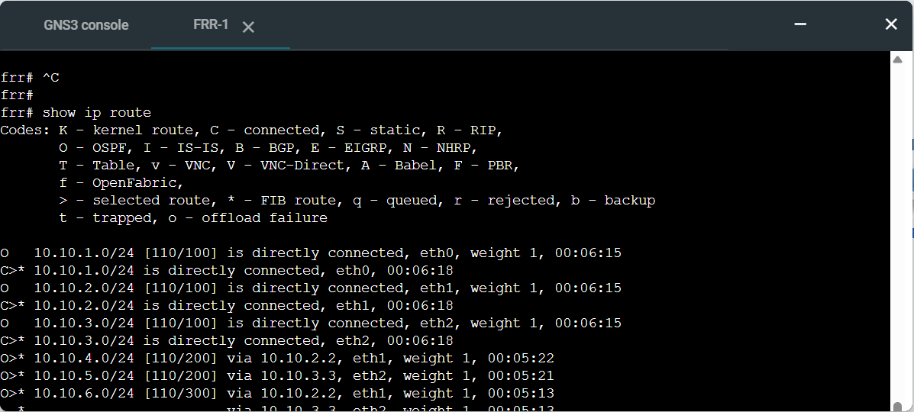

FRR2 – Full Routing Table

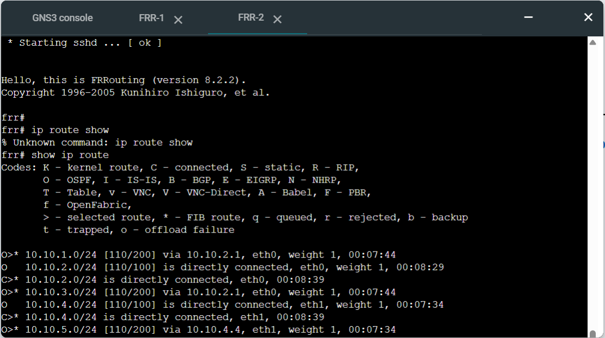

## Routing Summary Table

| Destination Network | Next Hop      |
| ------------------- | ------------- |
| 10.10.1.0/24        | Direct        |
| 10.10.2.0/24        | Direct        |
| 10.10.3.0/24        | Direct        |
| 10.10.4.0/24        | via 10.10.2.2 |
| 10.10.5.0/24        | via 10.10.3.3 |
| 10.10.6.0/24        | via 10.10.2.2 |

---

## Traceroute Testing
### Before Link Failure
traceroute 10.10.6.102

### Path Observed: 
#### Host1 → FRR1 → FRR2 → FRR4 → Host2  

- 10.10.1.1
- 10.10.3.3
- 10.10.4.4
- 10.10.6.102

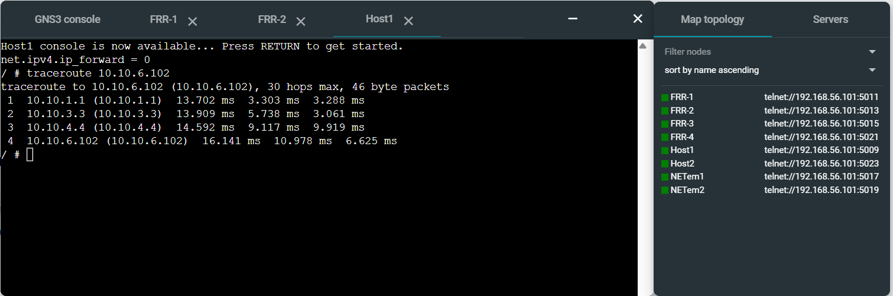

---

### After Link Failure (A NETem node was stopped to simulate link failure)
traceroute 10.10.6.102

### New Path:
#### Host1 → FRR1 → FRR3 → FRR4 → Host2

- 10.10.1.1
- 10.10.2.2
- 10.10.5.4
- 10.10.6.102

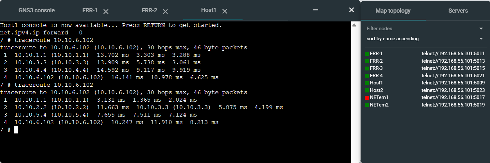

## Observation

Before the link failure, packets followed the shortest path through FRR2. After disabling the link, OSPF dynamically recalculated the routes and redirected traffic through FRR3. This demonstrates OSPF’s ability to automatically adapt to network changes and maintain connectivity without manual intervention.

---

## Reflection (Task 2)

This task demonstrated how OSPF dynamically updates routing tables when network conditions change. When a link failed, OSPF automatically recalculated the best path without manual intervention.

I learned that:
- OSPF uses metrics to choose the best path
- Routing updates happen automatically
- Network reliability improves with dynamic routing
