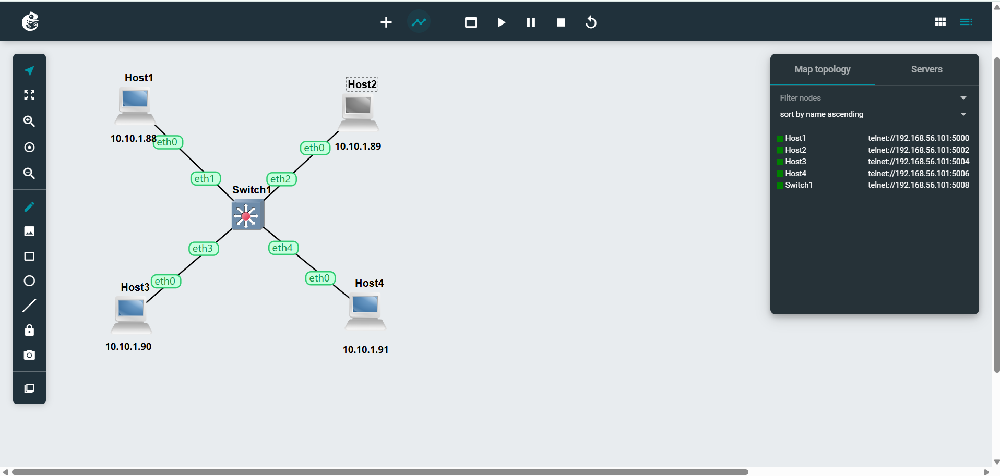
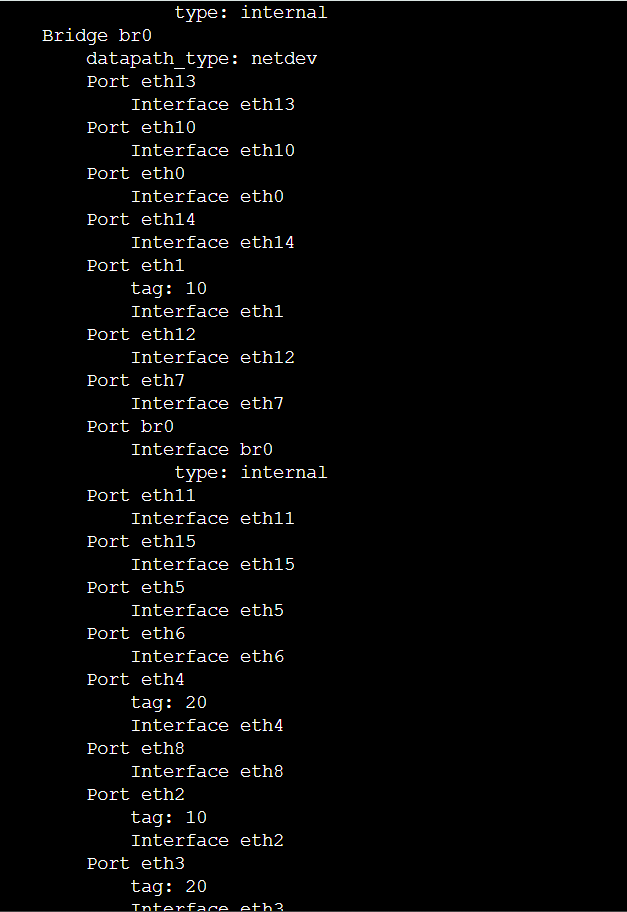
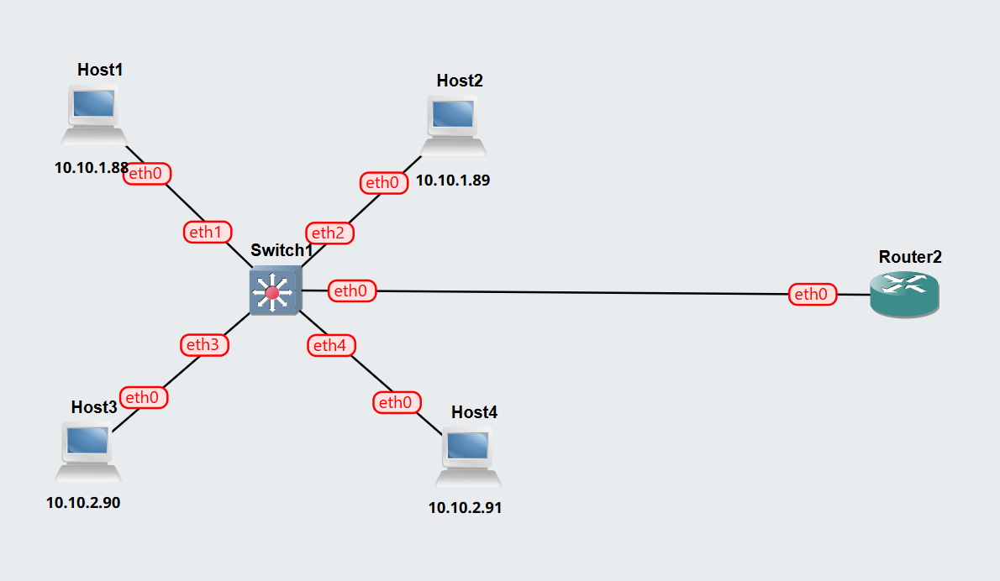
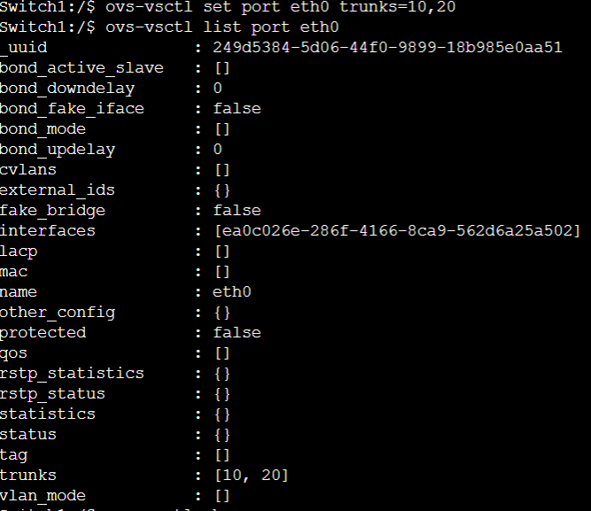
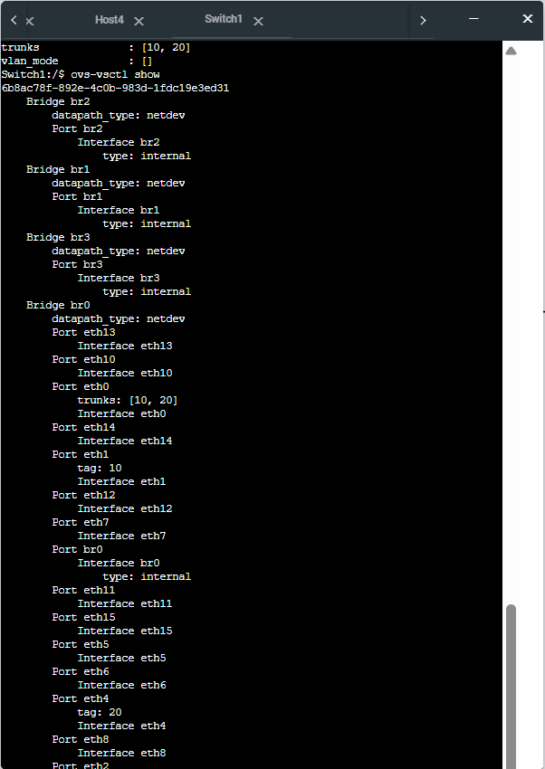
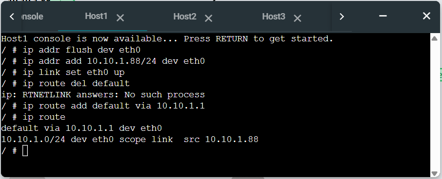
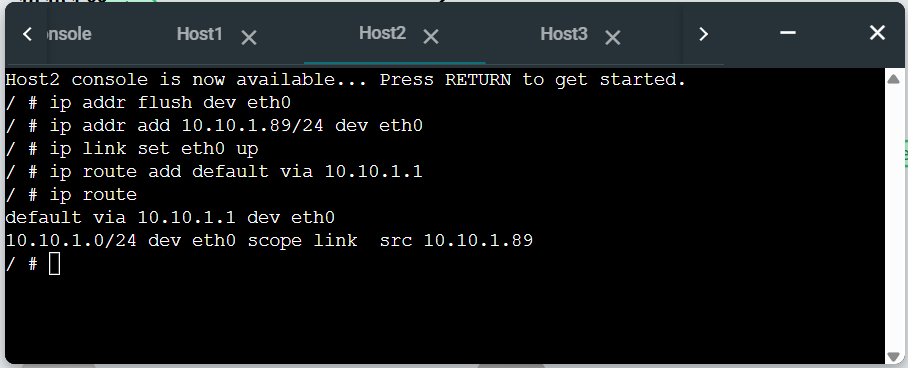
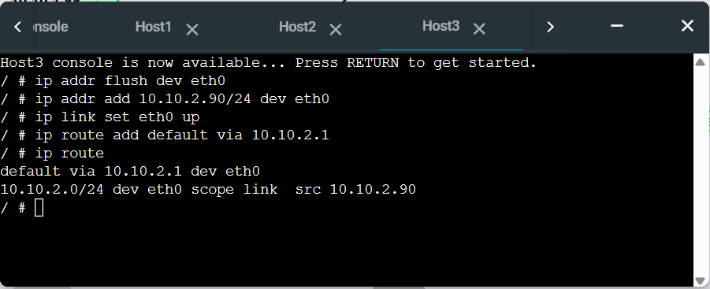
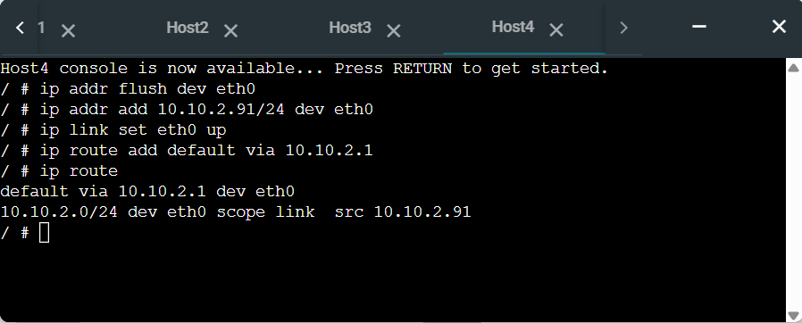

# Week 05 – VLAN Configuration & Inter-VLAN Routing

## 👤 Student Details
- **Name:** Tabib Al Adib  
- **Student ID:** 12307888  
- **Unit:** COIT20261 – Network Services and Automation  
- **Week:** 05  

---

# Task 1: VLAN Setup on Switch

## Objective
- Configure VLANs on a managed switch  
- Segment network using VLANs  
- Test connectivity within and across VLANs  

---

## Network Topology

[Vlan-Basics-12307888.gns3project](Vlan-Basics-12307888.gns3project)

---

## IP Address Configuration

| Host | IP Address |
|------|-----------|
| Host1 | 10.10.1.88 |
| Host2 | 10.10.1.89 |
| Host3 | 10.10.1.90 |
| Host4 | 10.10.1.91 |

---

## VLAN Configuration

| VLAN ID | Hosts | Ports |
|--------|------|------|
| 10 | Host1, Host2 | eth1, eth2 |
| 20 | Host3, Host4 | eth3, eth4 |

### Commands Used

- ovs-vsctl set port eth1 tag=10
- ovs-vsctl set port eth2 tag=10
- ovs-vsctl set port eth3 tag=20
ovs-vsctl set port eth4 tag=20

## Switch Ports & VLAN Tags

### Testing Results

| Source        | Destination    | Result    |
| ------------- | -------------- | --------- |
| Host1 → Host2 | Same VLAN      | ✔ Success |
| Host3 → Host4 | Same VLAN      | ✔ Success |
| Host1 → Host3 | Different VLAN | ❌ Failed  |
| Host2 → Host4 | Different VLAN | ❌ Failed  |

## Reflection (Task 1)

This task showed that VLANs logically separate networks even on the same physical switch. Devices in different VLANs cannot communicate without routing.

---

# Task 2: VLAN Routing (Inter-VLAN Communication)

## Objective
- Configure VLAN trunking
- Enable router-on-a-stick
- Allow communication between VLANs
  
## Network Topology

[Vlan-Router-12307888.gns3project](Vlan-Router-12307888.gns3project)

### Updated IP Addressing

VLAN 10 → Subnet 10.10.1.0/24
| Host  | IP         | Gateway   |
| ----- | ---------- | --------- |
| Host1 | 10.10.1.88 | 10.10.1.1 |
| Host2 | 10.10.1.89 | 10.10.1.1 |

VLAN 20 → Subnet 10.10.2.0/24
| Host  | IP         | Gateway   |
| ----- | ---------- | --------- |
| Host3 | 10.10.2.90 | 10.10.2.1 |
| Host4 | 10.10.2.91 | 10.10.2.1 |

## Switch Configuration (Trunk Port)

ovs-vsctl set port eth0 trunks=10,20

## Router Configuration (Sub-Interfaces)

ip link add link eth0 name eth0.10 type vlan id 10

ip link add link eth0 name eth0.20 type vlan id 20

ip addr add 10.10.1.1/24 dev eth0.10

ip addr add 10.10.2.1/24 dev eth0.20

ip link set eth0.10 up

ip link set eth0.20 up

sysctl -w net.ipv4.ip_forward=1

## Switch VLAN & Port Details

## Host Routing Tables
### Host1

### Host2

### Host3

### Host4

## Testing Results

### After Router Configuration
| Source        | Destination    | Result    |
| ------------- | -------------- | --------- |
| Host1 → Host2 | Same VLAN      | ✔ Success |
| Host3 → Host4 | Same VLAN      | ✔ Success |
| Host1 → Host3 | Different VLAN | ✔ Success |
| Host2 → Host4 | Different VLAN | ✔ Success |

## Reflection (Task 2)

This task demonstrated how inter-VLAN routing works using a router. Initially, VLANs isolated communication, but after configuring a trunk port and router sub-interfaces, all hosts could communicate.

### I learned that:

- Trunk ports carry multiple VLANs
- Router sub-interfaces handle each VLAN
- Inter-VLAN routing enables full network communication
  
### Key Insights
- VLANs improve segmentation but require routing for communication
- Router-on-a-stick is an efficient design
- Trunk ports are essential for VLAN communication
- Combining VLAN + routing creates scalable networks
