# Week 06 – ARP & Default Gateway Configuration

## Student Details
- **Name:** Tabib Al Adib  
- **Student ID:** 12307888  
- **Unit:** COIT20261 – Network Services and Automation  
- **Week:** 06  

---

# Task 1: ARP (Address Resolution Protocol)

## Objective
To observe how ARP maps IP addresses to MAC addresses and how ARP tables change during communication.

---

##  Command Used

ip neigh show

## Process & Results
### Step 1: Initial ARP Table
- ARP table initially empty or minimal
- 
### Step 2: Ping Between Hosts
ping 10.10.2.2

✔ Communication successful

### Step 3: ARP Table After Communication

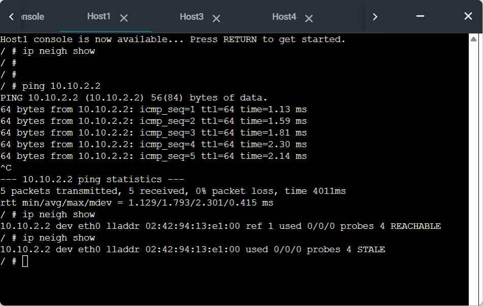

  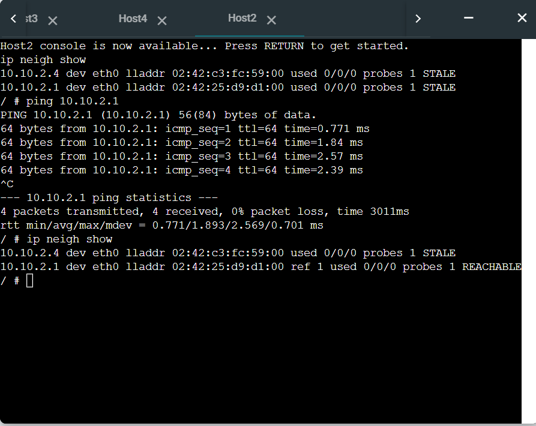

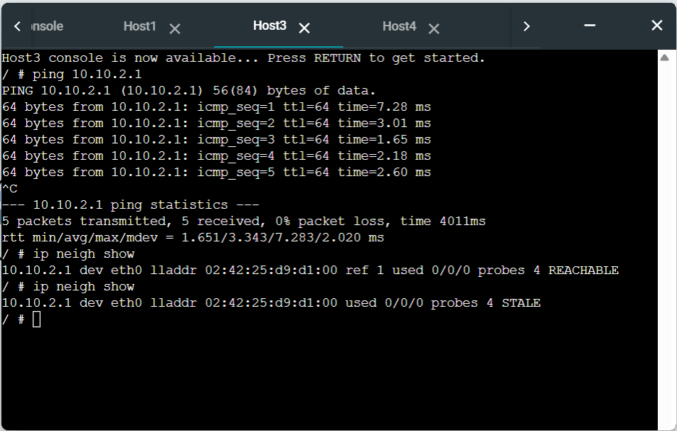

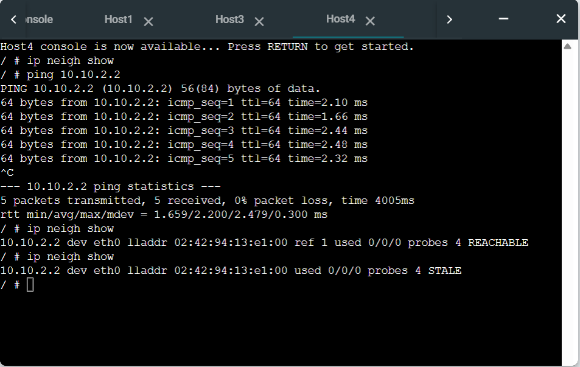

## Observations

| Host  | Observation                               |
| ----- | ----------------------------------------- |
| Host1 | Learned MAC of 10.10.2.2                  |
| Host2 | Contains entries for router + other hosts |
| Host3 | Learned gateway MAC                       |
| Host4 | Learned MAC after ping                    |

## ARP States

| State     | Meaning                  |
| --------- | ------------------------ |
| REACHABLE | Active and recently used |
| STALE     | Not recently used        |

## Reflection (Task 1)

ARP dynamically resolves IP to MAC addresses. Entries are created during communication and change state over time.

---

## Task 2: Default Gateway & Routing

### Objective

To configure multiple subnets and enable communication using default gateways and routing.

## Network Topology
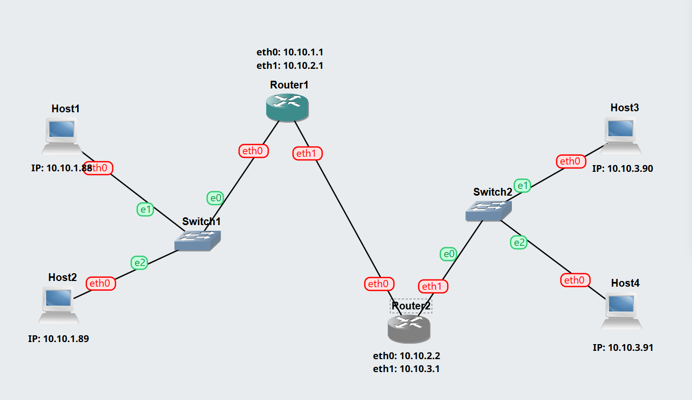

[Default-Gateway-12307888.gns3project](Default-Gateway-12307888.gns3project)
## Network Design
### Subnet A (10.10.1.0/24)
| Device | IP         | Gateway   |
| ------ | ---------- | --------- |
| Host1  | 10.10.1.88 | 10.10.1.1 |
| Host2  | 10.10.1.89 | 10.10.1.1 |

### Subnet B (10.10.2.0/24)
| Device       | IP        |
| ------------ | --------- |
| Router1 eth1 | 10.10.2.1 |
| Router2 eth0 | 10.10.2.2 |

### Subnet C (10.10.3.0/24)
| Device | IP         | Gateway   |
| ------ | ---------- | --------- |
| Host3  | 10.10.3.90 | 10.10.3.1 |
| Host4  | 10.10.3.91 | 10.10.3.1 |

## Router Configuration Summary

### Router1
- eth0 → 10.10.1.1
- eth1 → 10.10.2.1
- Forwarding enabled

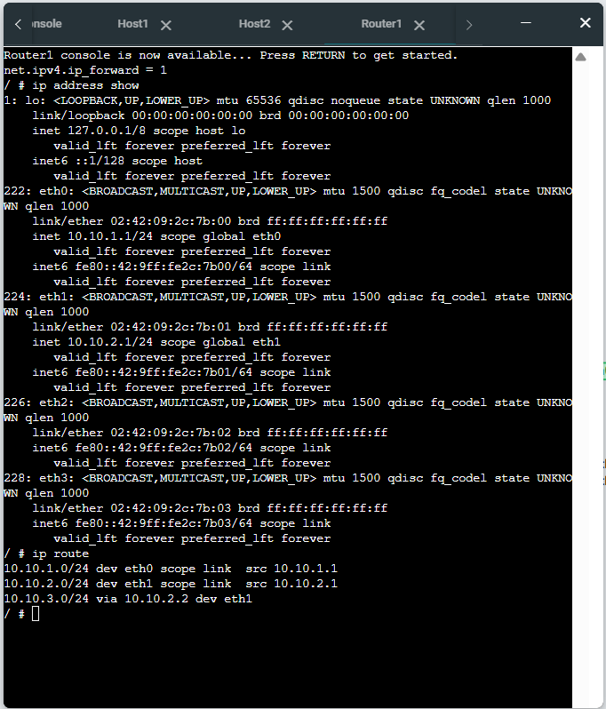

### Router2
- eth0 → 10.10.2.2
- eth1 → 10.10.3.1
- Forwarding enabled

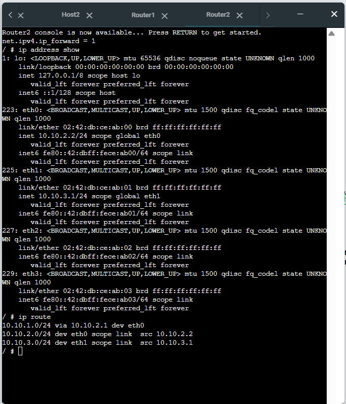

## Host Configuration

### Host1
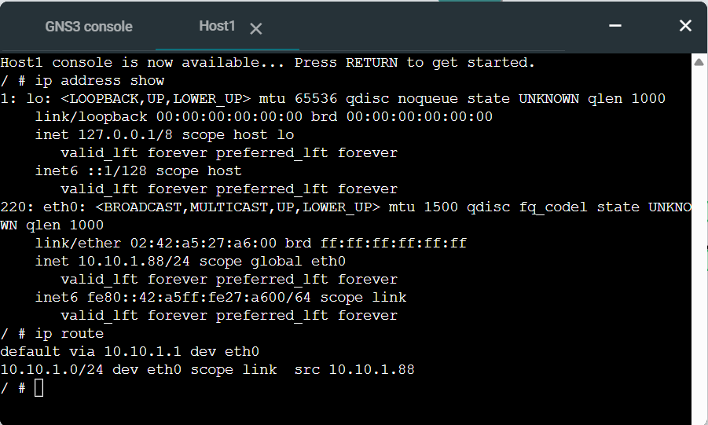

### Host2
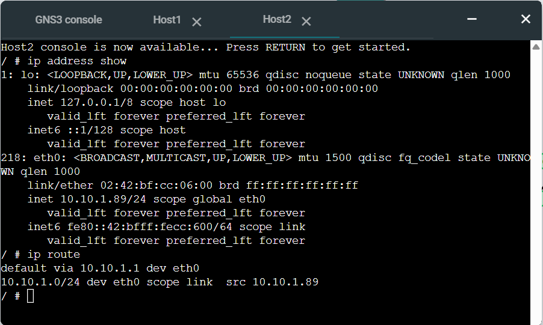

### Host3
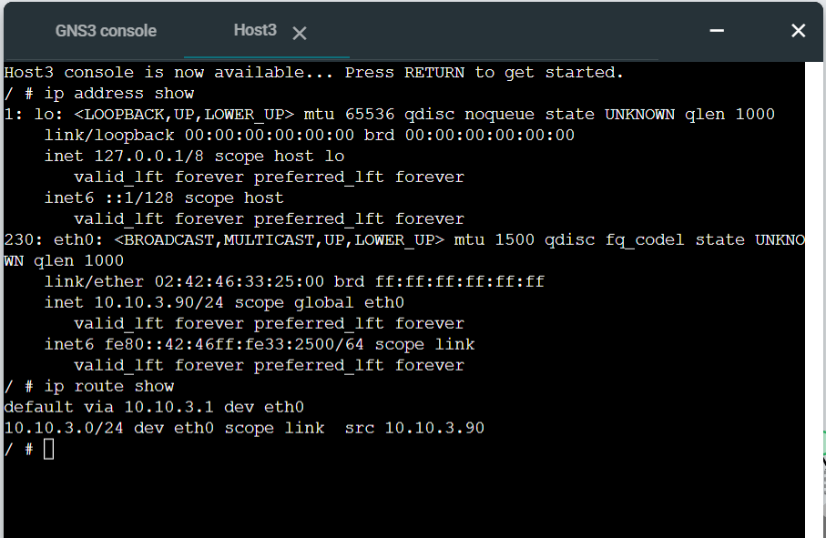

### Host4
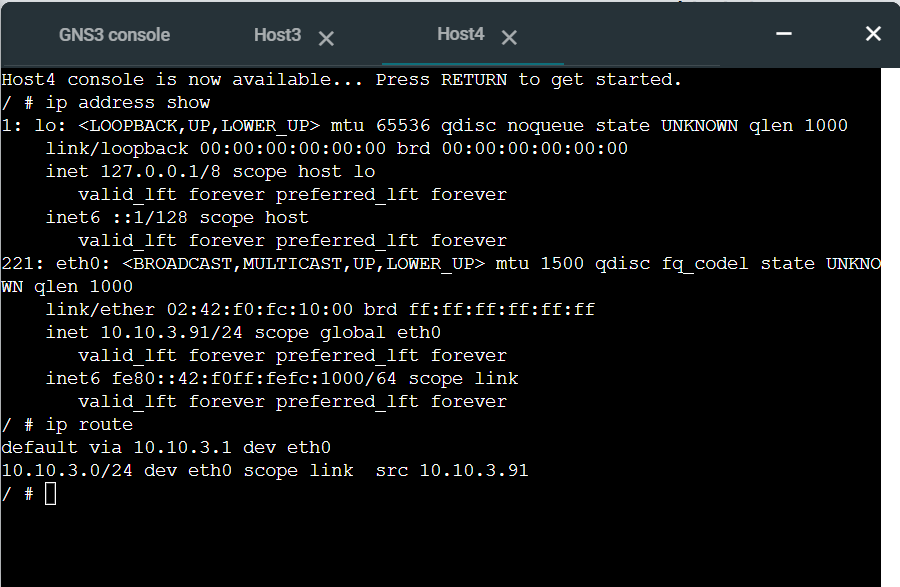

## Routing Tables Summary
| Device  | Key Route                        |
| ------- | -------------------------------- |
| Host1   | default via 10.10.1.1            |
| Host2   | default via 10.10.1.1            |
| Host3   | default via 10.10.3.1            |
| Host4   | default via 10.10.3.1            |
| Router1 | route to 10.10.3.0 via 10.10.2.2 |
| Router2 | route to 10.10.1.0 via 10.10.2.1 |

## Connectivity Test
### Cross-Network Ping
ping 10.10.1.88

✔ Successful communication across subnets

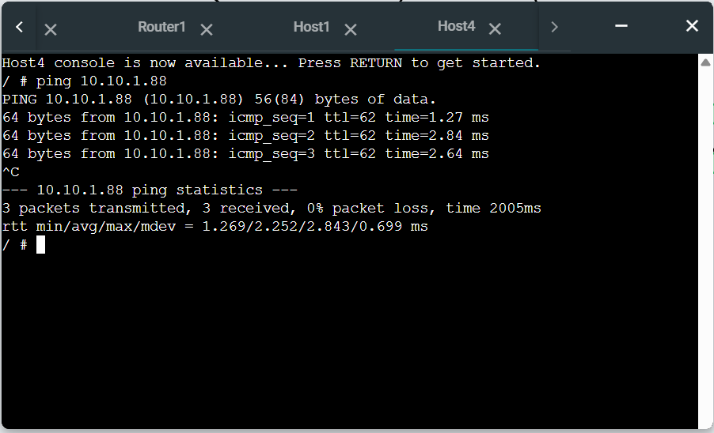

##  Observations
- Hosts communicate across different subnets 
- Routers forward packets correctly 
- Default gateways used for routing 

## Reflection (Task 2)

This task demonstrated how routing works between different networks.

I learned that:

- Hosts use default gateways to send traffic outside their subnet
- Routers forward packets between networks
- Static routing is sufficient for small networks
- IP forwarding must be enabled on routers
- 
## Key Insights
- Default gateway is essential for inter-network communication
- Routing tables determine packet paths
- Without routers, VLANs/subnets remain isolated
- Proper IP design is critical
