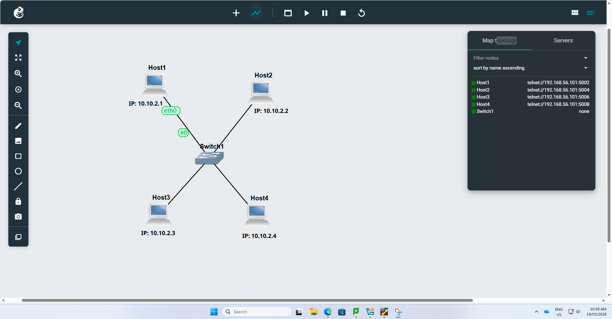
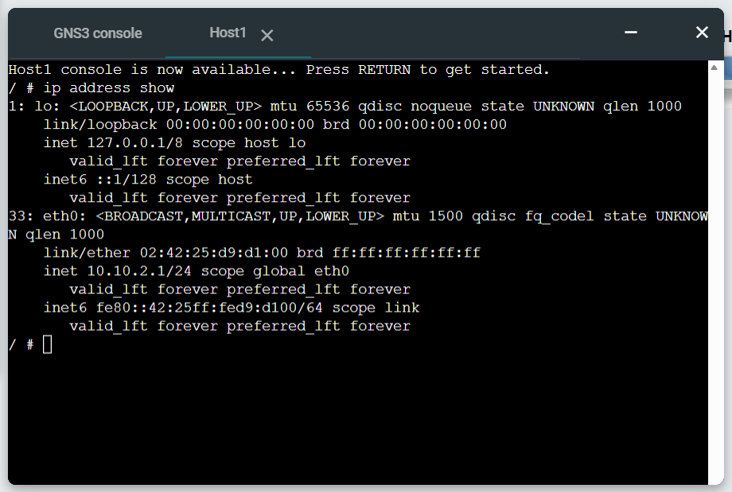
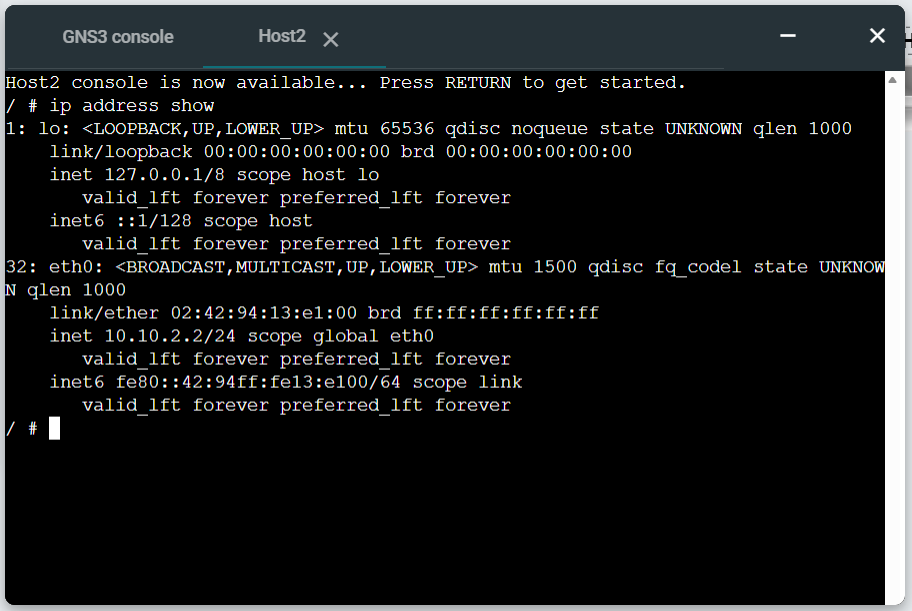
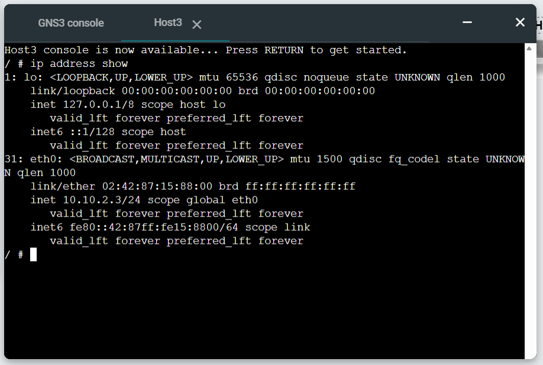
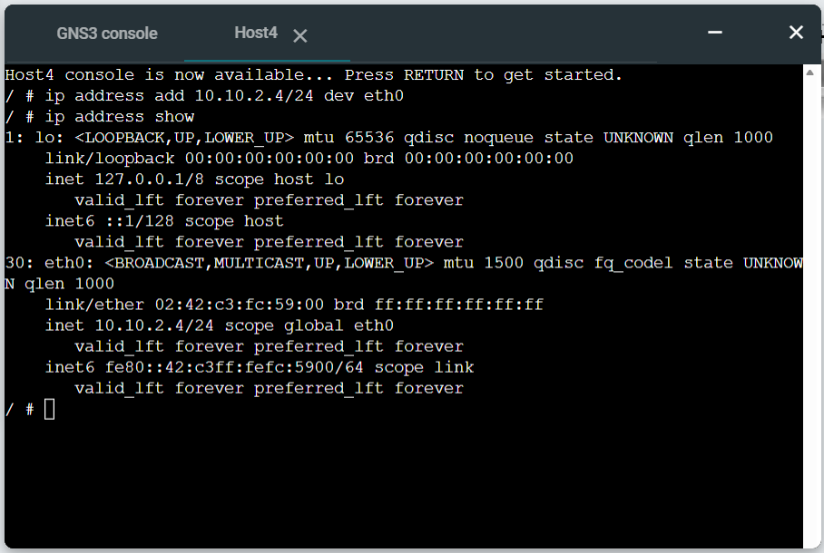
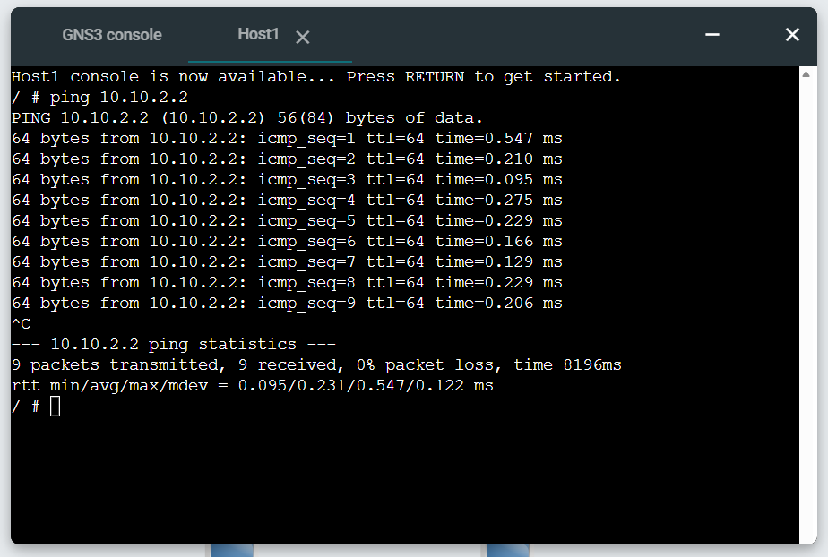
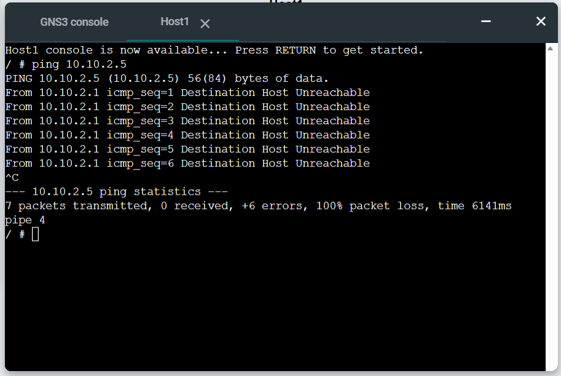
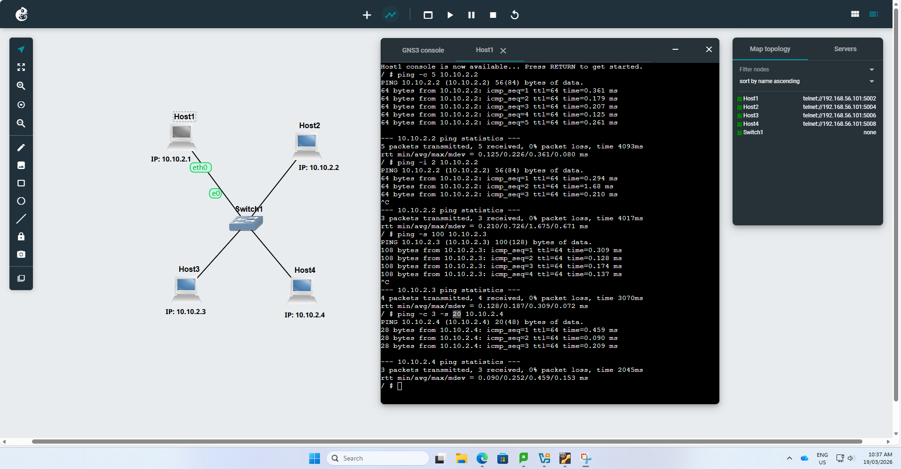

# Week 02 – Static IP Configuration & Network Testing

## Student Details
- **Name:** Tabib Al Adib  
- **Student ID:** 12307888  
- **Unit:** COIT20261 – Network Services and Automation  
- **Week:** 02  

---

## Objective
The objective of this lab was to:
- Configure static IP addresses using three different methods  
- Understand the difference between persistent and temporary configurations  
- Test network connectivity using ping  
- Analyse network performance using RTT and packet loss  

---

## Key Concepts Learned
- Static IP configuration using:
  - GNS3 Configure menu  
  - `/etc/network/interfaces`  
  - `ip address add` command  
- Difference between persistent and temporary IP assignment  
- Ping utility for:
  - Connectivity testing  
  - Measuring Round Trip Time (RTT)  
  - Detecting packet loss  

---

## Task 1: Setting Static IP Addresses

### Network Setup
- Created project: **Setting-IP-12307888**
- Added:
  - 4 × Linux Hosts  
  - 1 × Ethernet Switch  
- Connected all hosts into a LAN  

### IP Addressing Scheme
Network: **10.10.2.0/24**

| Host | Method Used | IP Address |
|------|------------|-----------|
| Host1 | GNS3 Configure | 10.10.2.1 |
| Host2 | GNS3 Configure | 10.10.2.2 |
| Host3 | /etc/network/interfaces | 10.10.2.3 |
| Host4 | ip command | 10.10.2.4 |

---

### Method 1: GNS3 Configure
- IP set before starting node

- Automatically applied on startup

✔ Persistent  

---

### Method 2: `/etc/network/interfaces`

Edited using:

nano /etc/network/interfaces

---

### Configuration:

auto eth0

iface eth0 inet static

   address 10.10.2.3
   
   netmask 255.255.255.0

### Applied changes:

ifdown eth0

ifup eth0

✔ Persistent after reboot

### Method 3: ip address add
ip address add 10.10.2.4/24 dev eth0

✔ Immediate effect

❌ Temporary (lost after reboot)

### Verification

Command used:

ip address show

✔ All hosts successfully configured with correct IP addresses

✔ All interfaces are active

## Task 2: Network Connectivity Testing
---

### Basic Ping Test

### Command:

ping 10.10.2.2

### Result:

Successful replies received

0% packet loss

RTT values observed

Confirms network connectivity between hosts

### Ping to Invalid IP

### Command:

ping 10.10.2.5

### Result:

Destination Host Unreachable

100% packet loss

### Confirms behaviour when destination does not exist

### Ping with Options

### Commands:

ping -c 5 10.10.2.2

ping -c 3 10.10.2.2

ping -s 100 10.10.2.3

ping -c 3 -s 20 10.10.2.4

### Explanation:

-c → Number of packets

-s → Packet size

### Result:

Controlled packet transmission

Larger packet size slightly increases delay

Custom count limits execution

### Reflection

This week enhanced my understanding of IP addressing and network testing. I learned that there are multiple ways to assign IP addresses, each with different advantages.

The /etc/network/interfaces method is useful for permanent configuration, while the ip address add command provides a quick but temporary solution.

The ping task helped me understand how to verify connectivity and diagnose issues. Observing RTT values provided insight into network performance, while testing an invalid IP demonstrated how packet loss occurs when a destination is unreachable.
